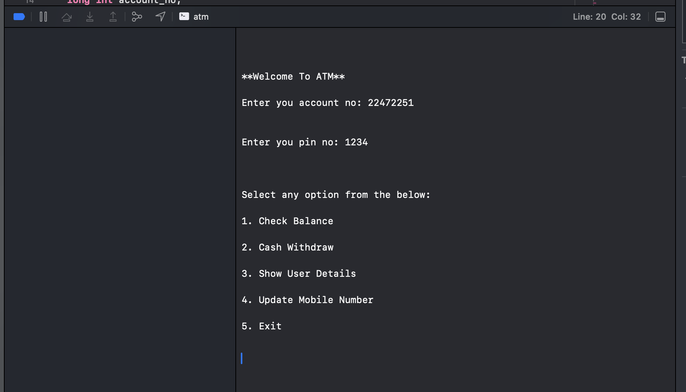

<!DOCTYPE html>
<html lang="en">
<body>
    <h1>ATM Mini-Project</h1>
    
This is a simple ATM simulation program written in C++. It provides basic functionality for managing an account, checking balances, and making withdrawals.

    <h2>Features</h2>
    <ul>
        <li><strong>Check Balance:</strong> View your account balance.</li>
        <li><strong>Cash Withdrawal:</strong> Withdraw funds from your account.</li>
        <li><strong>Show User Details:</strong> Display account holder information.</li>
        <li><strong>Update Mobile Number:</strong> Change your registered mobile number.</li>
        <li><strong>Exit:</strong> Quit the program.</li>
    </ul>
     <h2>Default Account Information</h2>
    
To get started with the ATM simulation, use the following default account details:

    <ul>
        <li><strong>Account Number:</strong> 22472251</li>
        <li><strong>PIN:</strong> 1234</li>
    </ul>
    
Feel free to explore the features using this default account. Good luck with your project! 🚀

    <h2>Usage</h2>
    <ol>
        <li>Compile the program using a C++ compiler (e.g., <code>g++ atm.cpp -o atm</code>).</li>
        <li>Run the compiled binary (<code>./atm</code>).</li>
        <li>Follow the on-screen instructions to interact with the ATM.</li>
    </ol>
    <h2>Example Output</h2>
    
    
  <h4> Keep exploring and learning as you continue your journey in Object-Oriented Programming (OOP). 🚀</h4>
</body>
</html>
